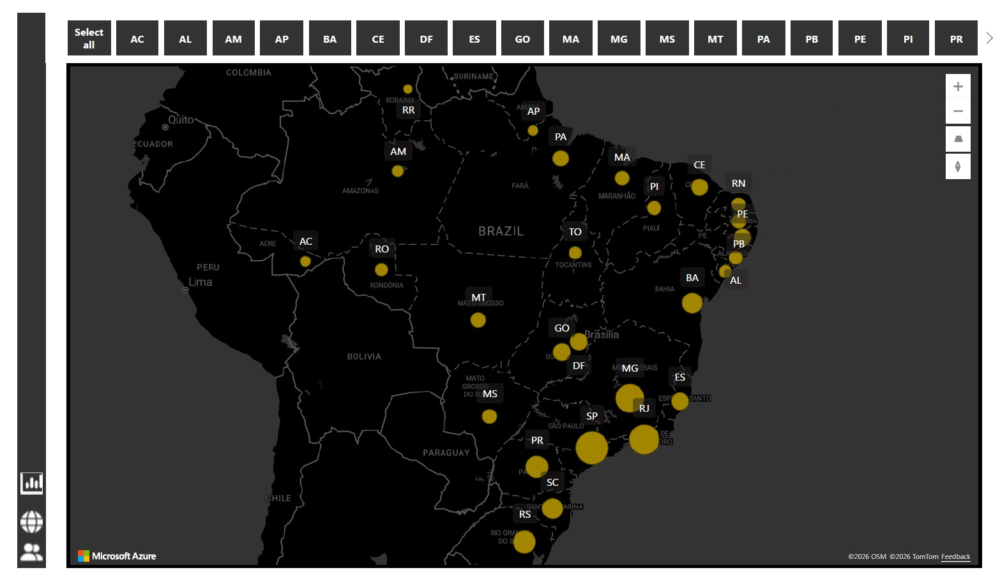

# Olist_Brazilian_Project
End-to-End Data Analysis of Brazilian E-Commerce Transactions using Python, SQL, and Power BI.

## Project Highlights
This project demonstrates:
- Data cleaning and preprocessing
- SQL data modeling
- Exploratory data analysis (EDA)
- Business KPI creation
- Dashboard reporting
- Version control with Git

## Project Overview
  
The goal of this project is to analyze transactional data from a Brazilian e-commerce platform to:

- Identify revenue trends
- Analyze customer behaviour
- Evaluate product category performance
- Monitor customer performance
- Detect cancellation patterns

The final result includes analytical queries, Python analysis, and an interactive dashboard.

## Dataset

The dataset used in this project is publicly available on Kaggle:
Olist Brazilian E-Commerce Dataset 
https://www.kaggle.com/datasets/olistbr/brazilian-ecommerce
The dataset is not included in this repository due to size and licensing considerations.

To reproduce the project:

1. Download the dataset from Kaggle
2. Extract CSV files
3. Place them inside the `data/` folder

## Project Structure

olist-brazilian-ecommerce-analysis/

- `data/`           # Raw dataset (CSV files not included)
- `notebooks/`      # Jupyter notebooks for data cleaning and exploratory analysis
- `sql/`            # SQL queries for creating tables and aggregations
- `dashboard/`      # Final dashboard report (PDF)
- `images/`         # Screenshots of dashboards and charts
- `requirements.txt`# Python dependencies
- `README.md`       # Project documentation

## Dashboard Preview
The complete dashboard report is available in PDF format:

[Project Overview](dashboard/Project%20Overview.pdf)

### Executive Dashboard
Summary of overall KPIs: total orders, revenue, cancellations, and key metrics.

### Sales Map
Visualizing geographical sales distribution across Brazil.

### Customer Detail View
Insights into customer behaviour, order frequency, and payment type.

### Category Tooltip
Interactive product category performance metrics.

## Tools & Technologies

- Python (Pandas, NumPy, Matplotlib)
- SQL
- Power BI
- Jupyter Notebook
- Git & GitHub

## How to Run the Project

1. Clone the repository
2. Install dependencies:

   pip install -r requirements.txt

3. Download the dataset from Kaggle
4. Place CSV files into `data/`
5. Run notebooks or Python scripts

## Author

Mariia Semenova 
Data Analytics Portfolio Project
